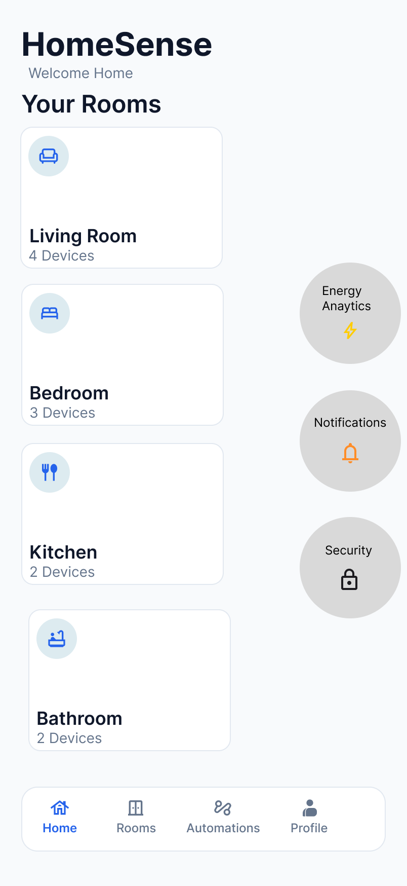
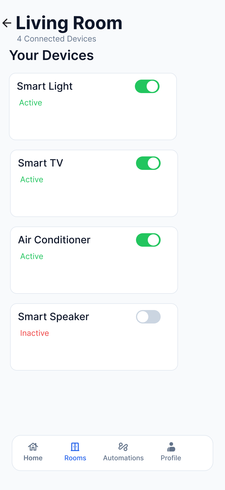
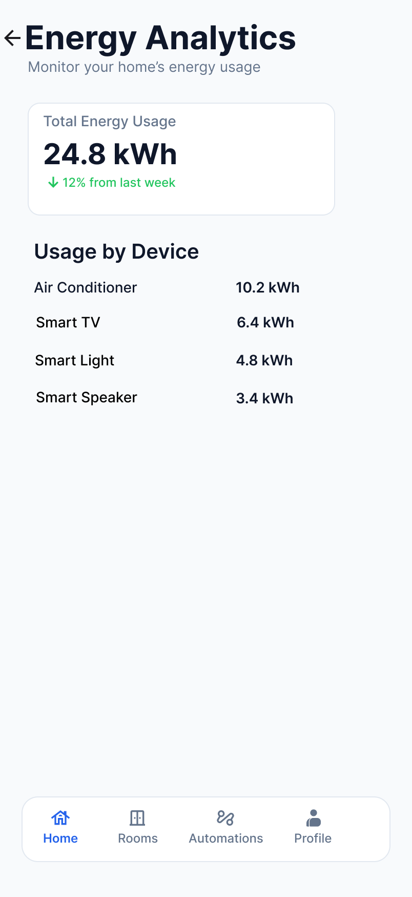
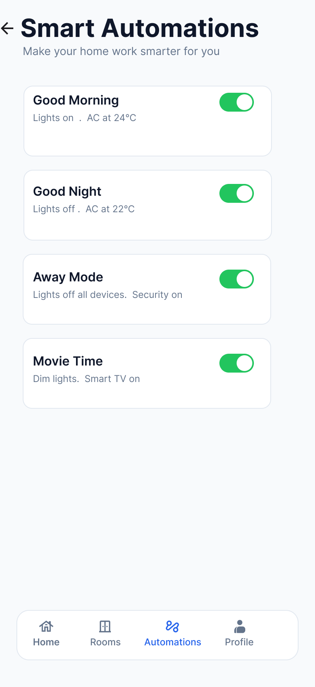
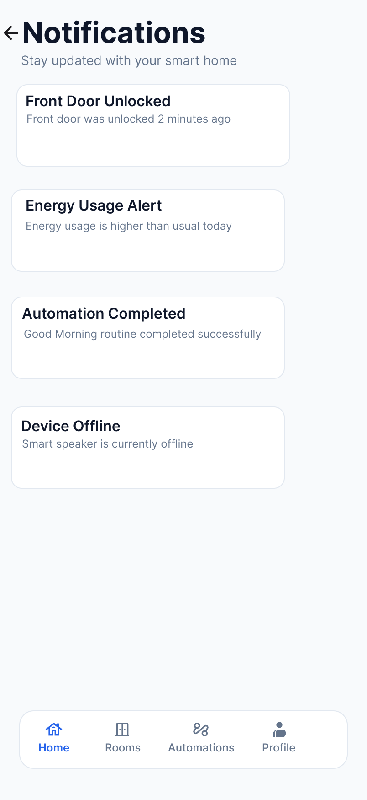
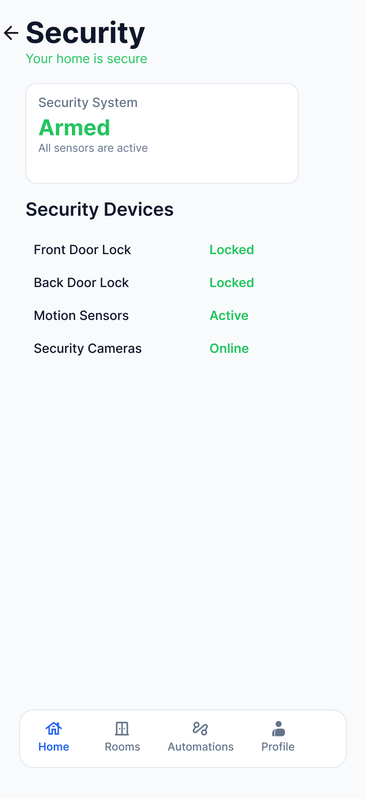
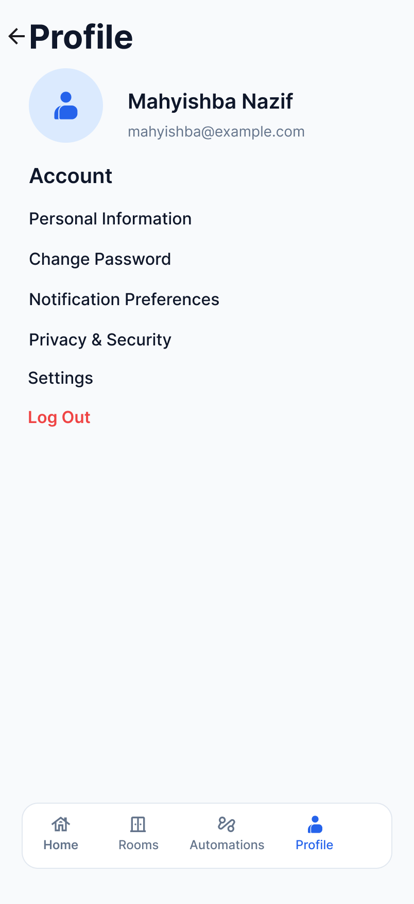
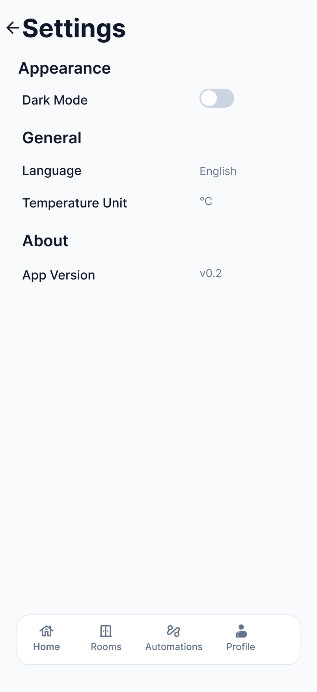

# 🏠 HomeSense v0.2

A modern Smart Home mobile application UI/UX prototype designed in **Figma**.

HomeSense v0.2 focuses on creating a clean, user-friendly experience for managing smart home devices, monitoring energy consumption, controlling automations, and enhancing home security.

---

## ✨ Features

- 🏡 Home Dashboard
- 🛏️ Room Management
- ⚡ Energy Analytics
- 🤖 Smart Automations
- 🔔 Notifications
- 🔒 Security Monitoring
- 👤 User Profile
- ⚙️ Settings
- 🎨 Design System
- 📱 Interactive Prototype

---

## 🛠️ Tools Used

- Figma
- Iconify
- Material Design Icons

---

## 📷 Screens

### Home

### Living Room

### Energy Analytics

### Smart Automations

### Notifications

### Security

### Profile

### Settings

---

## 🚀 Future Improvements

- Smart device scheduling
- Voice assistant integration (Google Assistant & Alexa)
- Real-time IoT device connectivity
- Multi-user household management
- Energy consumption insights with charts
- Push notifications for security events
- Device usage history and analytics

---

## 👨‍💻 Designed & Developed by

**Mahyishba Nazif*
